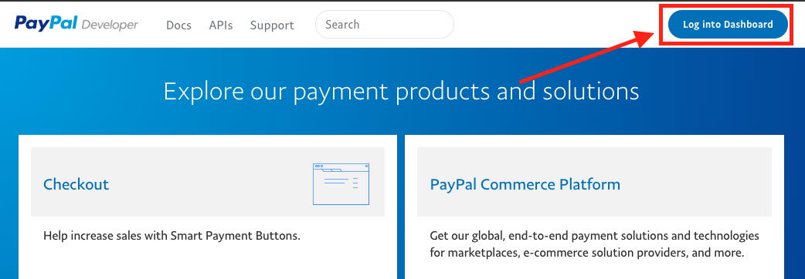

# Getting your Partner Account Setup

---

> **Disclaimer:** Any Applications/code/samples provided here is provided as-is.  These examples are intended to be **EXAMPLES** and are not intended to be used in a production environment.  I am employed at PayPal, however, the code/samples/documentation herein is provided from myself as an example not from PayPal, Inc.  I hope these are helpful to helping you understand the API's, but please do not use in a production environment.  Please refer to [PayPal's Developer Site](https://developer.paypal.com/ "PayPal Developer Homepage") for official documentation.

---

**NOTE:**

To have your account provisioned for [PayPal Commerce Platform](https://developer.paypal.com/docs/commerce-platform/ "Official PayPal Commerce Platform Documentation"), you MUST create a **new live account** that is explicitly for the use of [PayPal Commerce Platform](https://developer.paypal.com/docs/commerce-platform/ "Official PayPal Commerce Platform Documentation") as your account configuration will change the way funds settle in your account. This is especially important if you are planning on using the [Partner Fee](https://developer.paypal.com/docs/api/orders/v2/#definition-platform_fee "Official PayPal Platform Fee Documentation") as the Partner Fee will settle directly to your bank account on the account and not reflect in your PayPal Balance, additionally, this **new account** for [PayPal Commerce Platform](https://developer.paypal.com/docs/commerce-platform/ "Official PayPal Commerce Platform Documentation") should not receive any additional payments besides the [Partner Fee](https://developer.paypal.com/docs/api/orders/v2/#definition-platform_fee "Official PayPal Platform Fee Documentation").

Your [PayPal Commerce Platform](https://developer.paypal.com/docs/commerce-platform/ "Official PayPal Commerce Platform Documentation") Partner Account can **ONLY** be used to receive the [Partner Fee](https://developer.paypal.com/docs/api/orders/v2/#definition-platform_fee "Official PayPal Platform Fee Documentation") and facilitate transactions on behalf of Merchants.  You must not process any other types of transactions through this account, including being the primary receiver. The balance of your Partner account should remain empty.  If you need to collect payments beyond the [Partner Fee](https://developer.paypal.com/docs/api/orders/v2/#definition-platform_fee "Official PayPal Platform Fee Documentation") from buyers or sellers on your Platform, you need to use a separate PayPal account to receive those payments.

---

## Sandbox Application Configuration

To provision your [Sandbox](https://www.sandbox.paypal.com/us/home "Official PayPal Sandbox") Account to have the permissions/scopes set that will allow you to make API Calls as a Partner, you will need to create a Sandbox REST App that will provide you with the [Credentials](https://developer.paypal.com/docs/api/overview/#get-credentials "Official PayPal Credentials Steps") you will use to create an `access_token` that you will use to authenticate your API Calls to the [Sandbox API Endpoint(s)](https://developer.paypal.com/docs/api/overview/#make-rest-api-calls "Official PayPal API Docs").

As you go through the process, your Sales/Partner Manager will request your `Sandbox Account Email Address` and your `Sandbox Application client_id` so they can provision your account. 

> _Note: I provide an example application that is provisioned for each use-case documented in my documents here and provided within my Postman examples with each use-case_

Here is how you get your Sandbox information to provide to your Sales/Partner Manager:

1. Open [developer.paypal.com](https://developer.paypal.com "Official PayPal Developer Site"), then click the "Log into Dashboard" button in the top-right.

2. You will now log in with your LIVE PayPal Account Credentials. If you don't have a LIVE PayPal Account, you can [sign up for a PayPal Business Account](https://www.paypal.com/us/webapps/mpp/account-selection "Official PayPal Sign Up").  Once you sign-up you will receive an email for you to "Confirm your Email address", you MUST do this to ensure your Live account can be configured. 

3. Once logged in, you will start on the [My Apps & Credentials](https://developer.paypal.com/developer/applications "Official PayPal Sandbox Page") page.

4. Ensure that "Sandbox" is selected (in blue), and click "Create App".

5. Enter a name for your "App".. maybe "Partner Test Account App" or anything, it's really up to you.

6. Make sure your Faciliator account is the account selected in the "Sandbox Business Account" drop-down.  If you have created a new Sandbox account to use for this app, make sure it is selected here. Then click "Create App".

7.  On the next page, you will see your Sandbox Account with the value of your Sandbox Account Email address associated with this App, and your `client_id`. You will copy/paste this Sandbox Account Email address & this `client_id` and provide them to your Sales/Partner Manager to provision this app for you. 

8.  You will then save the email address, the `client_id`, and the `client_secret` in your application's Sandbox configuration, along with your accounts `merchant_id`. 

> Note: To obtain your account's `merchant_id`, click on the "Accounts" link on the left navigation under "SANDBOX", then next to that email address in the "Accounts List" hover over the ellipsis in the "Manage Account" column, and click "View/Edit Account".  On that page you will see the "Account ID" which is your `merchant_id` or `partner_id` when using the [PayPal Commerce Platform](https://developer.paypal.com/docs/commerce-platform/ "Official PayPal Commerce Platform Documentation") APIs.

## Live Application Configuration

Getting your Live account credentials is very similar to the steps for your Sandbox as I listed above. 

1. Open [developer.paypal.com](https://developer.paypal.com "Official PayPal Developer Site"), then click the "Log into Dashboard" button in the top-right.

2. You will now log in with your LIVE PayPal Account Credentials. If you don't have a LIVE PayPal Account, you can [sign up for a PayPal Business Account](https://www.paypal.com/us/webapps/mpp/account-selection "Official PayPal Sign Up").  Once you sign-up you will receive an email for you to "Confirm your Email address", you MUST do this to ensure your Live account can be configured.

3. Once logged in, you will start on the [My Apps & Credentials](https://developer.paypal.com/developer/applications "Official PayPal Sandbox Page") page.

4. Ensure that "Live" is selected (in blue), and click "Create App".

5. Enter a name for your "App".. maybe "Partner Live Account App" or anything, it's really up to you.

6. Click "Create App".

7.  On the next page, you will see your PayPal Account with the value of your Live Account Email address associated with this App, and your `client_id`. You will copy/paste this Live Account Email address & this `client_id` and provide them to your Sales/Partner Manager to provision this app for you.

8.  You will then save the email address, the `client_id`, and the `client_secret` in your application's Live configuration, along with your accounts `merchant_id`. 

> Note: To obtain your live account's `merchant_id`, Log into your live PayPal account at [paypal.com](https://www.paypal.com "Official PayPal Site"), click on the "gear" icon in the top right corner, then click on "Account Settings".  Then click on "Business Information" on the left navigation, and you will see your "PayPal Merchant ID". Here is a Direct Link to the [Business Information Page](https://www.paypal.com/businessmanage/account/aboutBusiness "Official PayPal Business Information Page").

Once you have provided your Sandbox information to your Sales/Partner Manager and they let you know that the account is provisioned, you may start using that account to test with.  Once you have completed the Sandbox Integration and your Live account has been provisioned, you may start processing in the PayPal Live Environment. 