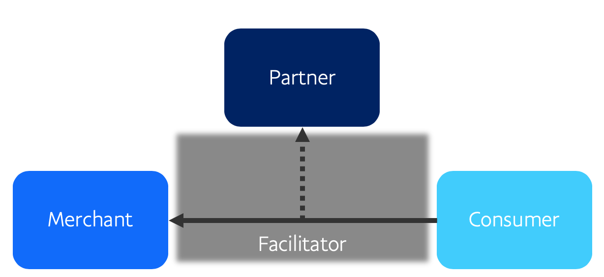
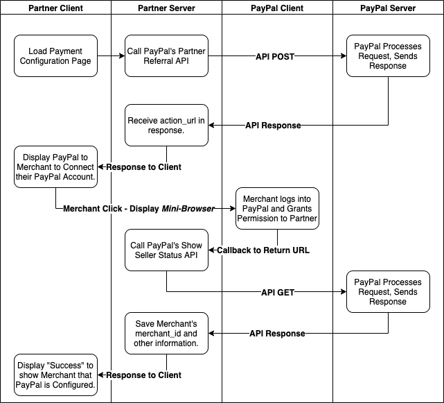
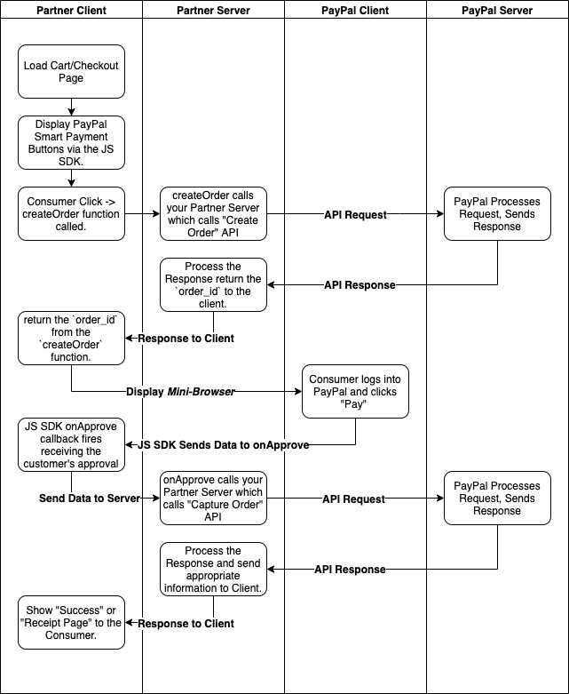
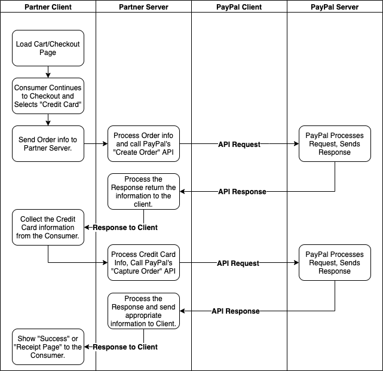

# PayPal Commerce Platform - Third Party Authentication - Onboarding, Checkout, and Refunds for PayPal Branded and Unbranded Transactions

> **Disclaimer:** Any Applications/code/samples provided here is provided as-is.  These examples are intended to be **EXAMPLES** and are not intended to be used in a production environment.  I am employed at PayPal, however, the code/samples/documentation herein is provided from myself as an example not from PayPal, Inc.  I hope these are helpful to helping you understand the API's, but please do not use in a production environment.  Please refer to [PayPal's Developer Site](https://developer.paypal.com/ "PayPal Developer Homepage") for official documentation.

**Use-Case/Model Description:**
    
This model allows for a Partner to act as a _Facilitator_ using the [PayPal Commerce Platform](https://developer.paypal.com/docs/commerce-platform/ "Official PayPal Commerce Platform Docs"). This allows for a Partner to onboard a merchant and obtain permissions to facilitate transactions from the consumer (`payer`) to the merchant (`payee`).

Model Diagram: 



**Postman Collection:** [https://documenter.getpostman.com/view/3823651/SWEB3GUh?version=latest](https://documenter.getpostman.com/view/3823651/SWEB3GUh?version=latest "Unofficial Postman Collection")

**PayPal Product API Executor:** [https://www.paypal.com/apex/home](https://www.paypal.com/apex/home "Official PayPal Demo API's")

## Account Setup and Configuration

The [PayPal Commerce Platform](https://developer.paypal.com/docs/commerce-platform/ "Official PayPal Commerce Platform Docs") requires that the _Partner Account_ is configured for some additional Platform permissions, and this requires review and some approvals to obtain access to particular features of the [PayPal Commerce Platform](https://developer.paypal.com/docs/commerce-platform/ "Official PayPal Commerce Platform Docs").  As this is true, I have configured a [PayPal Sandbox](https://www.sandbox.paypal.com/us/home "PayPal Sandbox Homepage") Account for the purposes of running through the samples of this use-case.

**PayPal Sandbox Testing Credentials:**

```json
{
    "partner_client_id": "AUOlt-Vi7Qvn_nNP7uhuKQ52BRCp1uy6qJab8WzCWPLvo2cRc9h8OOHhAHvz7dnMyLdHY96XGEyq8dd_",
    "partner_client_secret": "EFgaigTzAhleLwnb-lV8ARjlC-VUEaOyNKlaBDC2KZecVcnraGIfksmgHtB2EcgbD5lg2bbbXo-Jj0_v"
}
```

## Authentication

**Description:**

Third-Party Authentication will allow the Partner to Authenticate to PayPal using the Partner's `client_id` and `client_secret` to obtain an `access_token` that will be provided in the `Authentication` `header` of the API Request.  Along with the Partner's `access_token` the Partner will need to provide the `PayPal-Auth-Assertion` `header` which allows for the Partner to provide PayPal with the information on the merchant they are facilitating the API on behalf of.

| PayPal Documentation |
|:------------------------:|
| [Get an `access_token`](https://developer.paypal.com/docs/api/overview/#get-an-access-token "Official Authentication Doc") |
| [Authorization Assertion Header](https://developer.paypal.com/docs/api/reference/api-requests/#paypal-auth-assertion "Official Auth-Header Doc") |

To request an `access_token` you will `POST` your `client_id` and `client_secret` to the API Endpoint (`https://api.sandbox.paypal.com/v1/oauth2/token`) with the data of your `grant_type` set to `client_credentials`. 

Please see my [example on Postman](https://documenter.getpostman.com/view/3823651/SWEB3GUh?version=latest#97038b00-184c-4c8e-ae94-87938187604e "Unoffical API Example") to see an example of this request.

Additionally, feel free to review the [Official PayPal Documentation](https://developer.paypal.com/docs/api/overview/#get-an-access-token, "Official Authentication Doc") for requesting an `access_token` for additional information.


## Onboarding via Connected Path

**Description:**

For this sample we'll be using PayPal's [Connected Path Upfront Onboarding](https://developer.paypal.com/docs/commerce-platform/onboarding/upfront/ "Official Connected Path Documentation").  You may be asking _"What is Connected Path?"_.  The answer is quite straight forward, the [Connected Path Upfront Onboarding](https://developer.paypal.com/docs/commerce-platform/onboarding/upfront/ "Official Connected Path Documentation") means that the merchant can grant you (the Partner) permissions to act on their behalf, and they have agreed to the PayPal [User Agreement](https://www.paypal.com/us/webapps/mpp/ua/legalhub-full?locale.x=en_US "Official PayPal User Agreement") and will work with PayPal directly on any account inquiries.  Please read through the [PayPal Partner Program Agreement](https://www.paypal.com/us/webapps/mpp/ua/partner-program-agreement "Official Partner Program Agreement Documentation") and/or the [PayPal User Agreement](https://www.paypal.com/us/webapps/mpp/ua/legalhub-full?locale.x=en_US) for additional clarifications on the roles/responsibilities of the Partner and Merchant.

Onboarding Flowchart: 



The flowchart above shows the following steps:

1. You load the Partner Admin page that shows the "Payment Processor Options". 
2. As part of that load, you'll call the [Create Partner Referral API](https://developer.paypal.com/docs/api/partner-referrals/v2/#partner-referrals_create "Official PayPal API Documentation").
3. From the response, you'll use the `action_url` to populate the `href` value of the `Partner.js` script for [showing the *mini-browser* flow](https://developer.paypal.com/docs/commerce-platform/onboarding/upfront/#2-add-a-paypal-sign-up-link-on-your-site "Official Mini-Browser Sign-up Documentation").
4. The Merchant clicks the link to configure/connect PayPal, and the _mini-browser_ flow displays, the merchant logs into PayPal and grants permissions to you (the Partner).
5. The _mini-browser_ closes and the site is redirected to the `return_url` that you specified when you [created the Partner-Referral Link](https://developer.paypal.com/docs/api/partner-referrals/v2/#definition-partner_configuration_override "Official PayPal API Documentation").
6. When the merchant is returned to the `return_url` you specified, there will be `query_string` parameters passed to that `return_url`, for example:

```sh
<return_url>?merchantId=TRACK_731a6063-782b-4f04-8d85-9c51515ae42c&merchantIdInPayPal=QGM8S9F4SDMWY&permissionsGranted=true&consentStatus=true&productIntentId=addipmt&isEmailConfirmed=true&accountStatus=BUSINESS_ACCOUNT&riskStatus=SUBSCRIBED
```

7. Using the `merchantIdInPayPal` value, you will call the [Show Seller Status API](https://developer.paypal.com/docs/api/partner-referrals/v1/#merchant-integration_status "Official PayPal API Documentation"). The response will contain the Merchant's `merchant_id`, `payments_receivable` status, `primary_email_confirmed` status, the `merchant_client_id`, and the `scopes` array showing the `scopes` the merchant granted to you (the Partner).
8. You will want to **save** the information returned to you as needed, but you **will** need the `merchant_id` to [create the `PayPal-Auth-Assertion` header](https://developer.paypal.com/docs/api/reference/api-requests/#paypal-auth-assertion "Official PayPal-Auth-Assertion header Doc") that you will use when taking actions on behalf of the merchant.


## Checkout

Now that we have permissions granted to the Partner, the Partner is now able to facilitate transactions on behalf of the merchant.  I will quickly go through a few components of the PayPal Checkout experience.

### PayPal Checkout Flow



The Flowchart above shows the following steps:

1. The Partner will load the "Cart" or "Checkout" page that will show [PayPal's Smart Payment Buttons](https://developer.paypal.com/docs/checkout/ "Official PayPal Checkout Documentation") to the Consumer (`payer`).
2. The [JS SDK Script](https://developer.paypal.com/docs/checkout/integrate/#2-add-the-paypal-javascript-sdk-to-your-web-page "Official PayPal JS SDK Documentation") will load on the page and the [Smart Payment Buttons will Render](https://developer.paypal.com/docs/checkout/integrate/#3-render-the-smart-payment-buttons "Official PayPal Button Render Documentation"). 
3. The Consumer (`payer`) click's one of the buttons rendered, which causes the [`createOrder()` function to fire](https://developer.paypal.com/docs/checkout/integrate/#4-set-up-the-transaction "Official PayPal createOrder Documentation").
4. The `createOrder` function will [call your (the Partner) server](https://developer.paypal.com/demo/checkout/#/pattern/server "Official JS SDK Server Documentation").
5. Your (Partner) server will receive the request from the client (`createOrder` function), and process the data then send an API Call to [Create the PayPal Order](https://developer.paypal.com/docs/api/orders/v2/#orders_create "Official PayPal Order API Documentation").
6. Your (Partner) server, will receive a response from the API containing the Order's `id`, your server will `return` the Order's `id` to the Client, then `return` the `id` from the `createOrder` function.  By returning this Order `id`, this will launch [PayPal's _Mini-Browser_ Checkout Flow](https://developer.paypal.com/docs/commerce-platform/payment/checkout/ "Official PayPal Checkout Flow Documentation").
7. The Consumer (`payer`) will login to PayPal, select their options, and click "Pay" or "Continue" depending on the [`commit` flow you're setting in the JS SDK](https://developer.paypal.com/docs/checkout/reference/customize-sdk/ "Official PayPal JS SDK Documentation").
8. Once the "Pay" or "Continue" button is clicked, the _Mini-Browser_ will close and the `onApprove` callback function will fire, you will then use the data sent through the `onApprove` function to call your (Partner) server to call the [Capture payment for Order API](https://developer.paypal.com/docs/api/orders/v2/#orders_capture "Official PayPal Capture Order Documentation").
9. Your (Partner) server receives the response from the PayPal API, then responds to the client with applicable information.
10. The client receives the information and displays a "Thank You" or "Receipt Page" to the Consumer (`payer`).


### Credit Card Checkout with the Order API

Credit Card Checkout Flowchart: 



This Checkout Flow is very similar to the [PayPal Checkout Flow](#paypal-checkout-flow) above; When the consumer elects to Checkout, you will start with the [Creation of the PayPal Order](https://developer.paypal.com/docs/api/orders/v2/#orders_create "Official PayPal Order API Documentation").  Then once you've created the Order, you will [Capture the Order](https://developer.paypal.com/docs/api/orders/v2/#orders_capture "Official PayPal Order Capture API Documentation"). The only difference is that you won't need to have the consumer login to PayPal, and you'll simply provide their Credit Card information in the call to [Capture the Order as seen in my Postman example](https://documenter.getpostman.com/view/3823651/SWEB3GUh?version=latest#c651a0f4-4664-4fa6-b0df-fbfc920a3772 "Unofficial API Example").

## Refunding the Transaction

Once you [Capture the Order](https://documenter.getpostman.com/view/3823651/SWEB3GUh?version=latest#cdb4ef99-abcd-488b-8617-3b09ea55f7bf "Unofficial API Example") you will want to save the `response.purchase_units[0].payments.captures[0].id` as that `id` is the "Capture ID" that you will use when you Refund the Order.  Within the `POST` to Refund the Capture, you will include the `capture_id` in the URL along with the various `headers` (`PayPal-Auth-Assertion`, `PayPal-Partner-Attribution-Id`, `PayPal-Request-Id`, and of course the `Authorization`). And you may optionally provide `amount` information, an `invoice_id`, and optionally a `note_to_payer`.  You can view my [example refund API on Postman](https://documenter.getpostman.com/view/3823651/SWEB3GUh?version=latest#acb69b95-0f7d-4182-9908-38379f8bd2ec "Unofficial API Example").

Please see the [Refund Captured Payment Documentation](https://developer.paypal.com/docs/api/payments/v2/#captures_refund "Official API Documentation") for additional info on the fields & functionality of the API.
